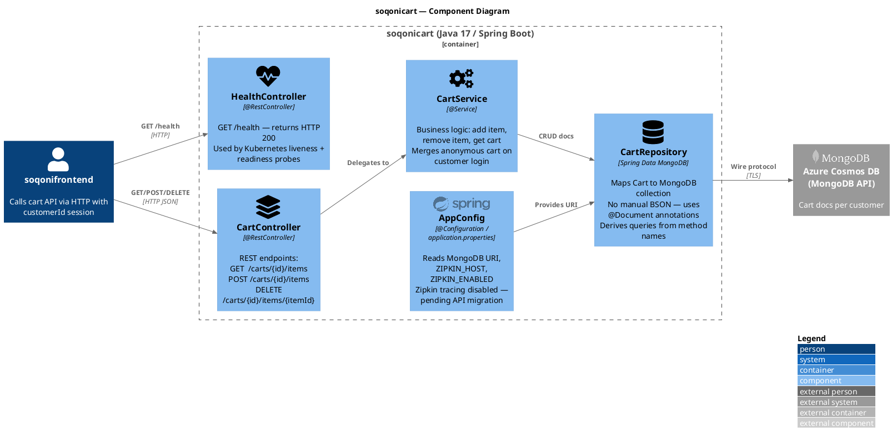

#+HTML: 
 &nbsp;  &nbsp;  &nbsp;  &nbsp;  &nbsp; 

* soqonicart

Java 17 / Spring Boot microservice providing the shopping cart API for the [[https://github.com/abdvswmdr/soqoni][Soqoni]] e-commerce platform. Manages per-customer carts in MongoDB via Spring Data.

#+attr_html: :width 900px :align center :alt "Cart API demo"
[[file:docs/demo.gif]]

** Contents

- [[#features][Features]]
- [[#api][API]]
- [[#architecture][Architecture]]
- [[#environment-variables][Environment Variables]]
- [[#build][Build]]
- [[#development][Development]]
- [[#cicd][CI/CD]]
- [[#license][License]]

** Features

- Spring Boot REST API with Spring Data MongoDB — automatic Java ↔ BSON mapping
- Per-customer cart isolation via ~customerId~ path variable
- Multi-stage Docker build: ~maven:3.9-eclipse-temurin-17~ → ~eclipse-temurin:17-jre-alpine~ runtime
- Fully configurable via environment variables — no hardcoded connection strings
- Kubernetes-ready: ClusterIP service on port 80, targetPort 8081

** API

| Endpoint                           | Method | Description            |
|------------------------------------+--------+------------------------|
| ~/carts/{customerId}~                | GET    | Get cart for customer  |
| ~/carts/{customerId}~                | DELETE | Delete cart            |
| ~/carts/{customerId}/items~          | GET    | List items in cart     |
| ~/carts/{customerId}/items~          | POST   | Add item to cart       |
| ~/carts/{customerId}/items~          | DELETE | Remove all items       |
| ~/carts/{customerId}/items/{itemId}~ | GET    | Get a specific item    |
| ~/carts/{customerId}/items/{itemId}~ | DELETE | Remove a specific item |
| ~/carts/{customerId}/items/{itemId}~ | PATCH  | Update item quantity   |

#+BEGIN_SRC bash
# Add an item to a cart
curl -X POST http://localhost:8081/carts/customer-1/items \
  -H "Content-Type: application/json" \
  -d '{"itemId": "abc-123", "quantity": 2, "unitPrice": 14.99}'

# View cart contents
curl http://localhost:8081/carts/customer-1/items
#+END_SRC

** Architecture

#+attr_html: :width 900px :align center :alt "Cart service architecture"

Requires a running MongoDB instance (default: ~carts-db:27017~).

** Environment Variables

| Variable | Default | Description |
|---|---|---|
| ~db~ | ~carts-db~ | MongoDB hostname |
| ~ZIPKIN_ENABLED~ | ~false~ | Enable Zipkin distributed tracing |
| ~ZIPKIN_HOST~ | ~zipkin~ | Zipkin server hostname |
| ~port~ | ~8081~ | Port this service listens on |

** Build

#+BEGIN_SRC bash
# Run tests
mvn test

# Build production image with versioned tag
TAG=$(git rev-parse --short HEAD)
docker build -t abdvswmdr/soqonicart:$TAG .
docker push abdvswmdr/soqonicart:$TAG
#+END_SRC

** Development

#+BEGIN_SRC bash
# Run locally (MongoDB on localhost:27017)
mvn spring-boot:run
#+END_SRC

Requires Java 17+ and Maven 3.6+.

** License

[[LICENSE][GNU General Public License v3.0]]
